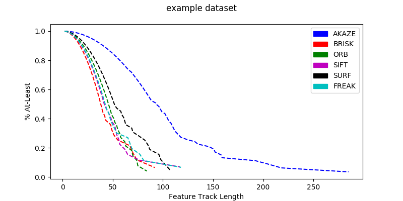

# Running an example:

1. Download the example dataset from here: https://drive.google.com/file/d/1EXNRWHJtd5h8mbiexAPw2dt1yLEDcOcJ/view?usp=sharing
1. Uncompress the test dataset:
    ```bash
    tar -xvf outdoor_image_comparison_example.tar.gz
    ```
1. Change the following line in histogram.py:
    ```python
    input_path = "<path_to_the_example_dataset>"
    ```
1. Finally run the python script:
    ```bash
    mkdir <path_to_output_folder>
    ./histogram.py <path_to_output_folder> regen
    ```

You should end up with a graph like this:

