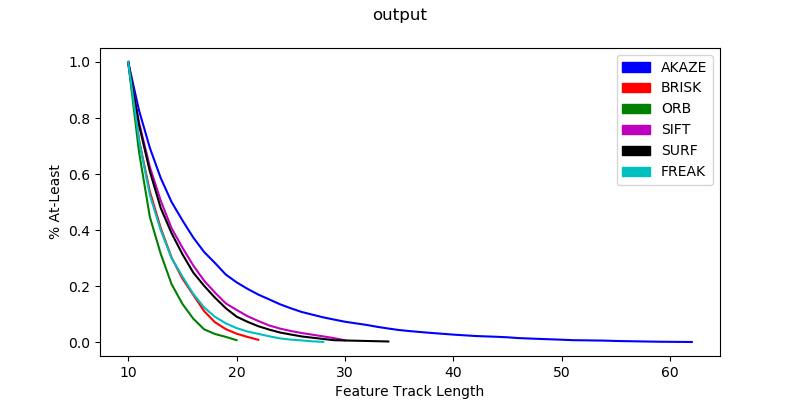

# Running an example:

1. Create the data folder to put your images in:
    ``` bash
    mkdir data
    cd data
    ```
1. Download the example dataset from here: https://drive.google.com/open?id=1EXNRWHJtd5h8mbiexAPw2dt1yLEDcOcJ
1. Uncompress the test dataset:
    ```bash
    tar -xvf outdoor_image_comparison_example.tar.gz
    ```
1. Run the python script from the directory of the project (trimming noise data):
    ```bash
   ./histogram.py --start_length 10 --trim_less_than 10 --regen True    --input=data/outdoor_image_comparison_example/test_images 
    ```

You should end up with a graph like this:

